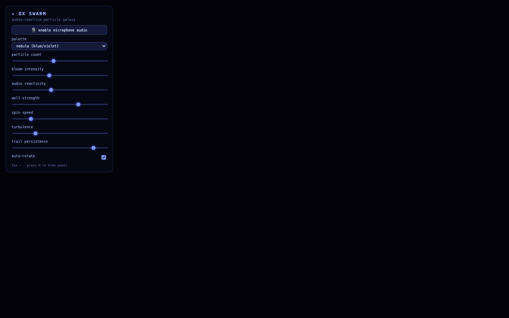

# OX Galaxy

An audio-reactive WebGL particle galaxy with mouse gravity wells, bloom, and a live control panel. Built with Three.js.

Features: 100k+ GPU particles | audio reactivity | interactive gravity wells | real-time bloom

## Run it

Open `index.html` in any browser (or `python3 main.py` for terminal projects) — no dependencies beyond what's noted in the source.

Source: [github.com/JacobEGarcia/ox-galaxy](https://github.com/JacobEGarcia/ox-galaxy)
